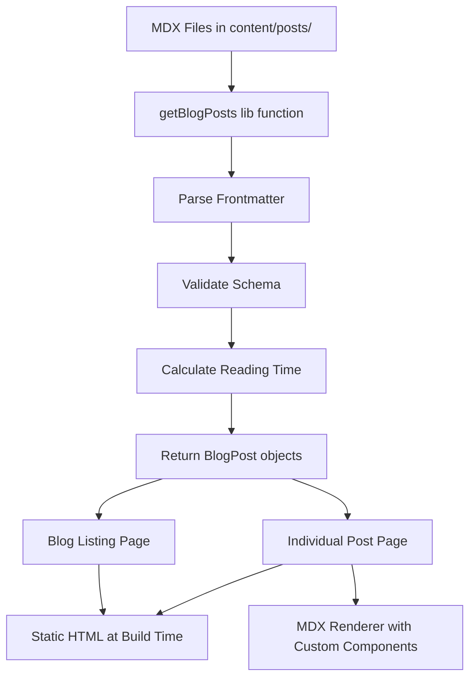

# Design Document: Blog System

## Overview

The Blog System is a feature module for KanaDojo that enables static, SEO-optimized blog content about Japanese language learning. The system uses MDX (Markdown with JSX) for content authoring, allowing rich educational content with embedded React components while maintaining excellent SEO through Next.js static generation.

### Key Design Decisions

1. **MDX over plain Markdown**: Enables embedding interactive components (kana charts, furigana text, quizzes) directly in content
2. **File-based content**: Blog posts stored as MDX files in the feature directory, no database required
3. **Static generation**: All blog pages pre-rendered at build time for optimal Core Web Vitals
4. **Locale-based organization**: Content organized by locale with English fallback
5. **Frontmatter validation**: TypeScript-enforced schema for post metadata

## Architecture

```
┌─────────────────────────────────────────────────────────────────┐
│                    app/[locale]/blog/                           │
│              Page Routes (SSG with generateStaticParams)        │
└─────────────────────────────────────────────────────────────────┘
                              ↓
┌─────────────────────────────────────────────────────────────────┐
│                    features/Blog/                               │
│    Components, Content, Lib, Types (Self-contained module)      │
└─────────────────────────────────────────────────────────────────┘
                              ↓
┌─────────────────────────────────────────────────────────────────┐
│                    shared/ & core/                              │
│         SEO Components, i18n, UI Components                     │
└─────────────────────────────────────────────────────────────────┘
```

### Data Flow



## Components and Interfaces

### Directory Structure

```
features/Blog/
├── components/
│   ├── BlogCard.tsx              # Post preview card for listings
│   ├── BlogList.tsx              # Grid/list of blog cards with filtering
│   ├── BlogPost.tsx              # Full post renderer
│   ├── TableOfContents.tsx       # Auto-generated TOC from headings
│   ├── RelatedPosts.tsx          # Related posts section
│   ├── CategoryFilter.tsx        # Category filter buttons
│   └── mdx/
│       ├── FuriganaText.tsx      # Japanese text with furigana
│       ├── KanaChart.tsx         # Interactive kana chart
│       ├── InfoBox.tsx           # Styled callout boxes
│       ├── QuizQuestion.tsx      # Interactive quiz component
│       └── index.ts              # MDX component mappings
├── content/
│   └── posts/
│       ├── en/
│       │   ├── hiragana-guide.mdx
│       │   └── katakana-basics.mdx
│       ├── es/
│       │   └── guia-hiragana.mdx
│       └── ja/
│           └── hiragana-guide.mdx
├── lib/
│   ├── getBlogPosts.ts           # Content fetching and parsing
│   ├── getBlogPost.ts            # Single post fetching
│   ├── generateBlogMetadata.ts   # SEO metadata generation
│   ├── calculateReadingTime.ts   # Reading time calculation
│   └── validateFrontmatter.ts    # Frontmatter schema validation
├── types/
│   └── blog.ts                   # TypeScript interfaces
└── index.ts                      # Barrel exports

app/[locale]/blog/
├── page.tsx                      # Blog listing page
└── [slug]/
    └── page.tsx                  # Individual post page
```

### Component Specifications

#### BlogCard

- **Props**: `post: BlogPostMeta`
- **Renders**: Card with title, description, category badge, reading time, date
- **Behavior**: Links to individual post page

#### BlogList

- **Props**: `posts: BlogPostMeta[]`, `selectedCategory?: Category`
- **Renders**: Grid of BlogCard components
- **Behavior**: Filters posts by category when selected

#### BlogPost

- **Props**: `post: BlogPost`, `relatedPosts?: BlogPostMeta[]`
- **Renders**: Full article with MDX content, TOC, related posts
- **Behavior**: Renders MDX with custom component mappings

#### TableOfContents

- **Props**: `headings: Heading[]`
- **Renders**: Nested list of heading links
- **Behavior**: Smooth scroll to heading on click

#### MDX Components

- **FuriganaText**: `<FuriganaText kanji="日本語" reading="にほんご" />`
- **KanaChart**: `<KanaChart type="hiragana" showRomaji={true} />`
- **InfoBox**: `<InfoBox type="tip">Content here</InfoBox>`
- **QuizQuestion**: `<QuizQuestion question="..." options={[...]} answer={0} />`

## Data Models

### BlogPostMeta (Frontmatter)

```typescript
interface BlogPostMeta {
  title: string; // Post title (required)
  description: string; // SEO meta description (required)
  slug: string; // URL slug derived from filename
  publishedAt: string; // ISO 8601 date string (required)
  updatedAt?: string; // ISO 8601 date string (optional)
  author: string; // Author name (required)
  category: Category; // Post category (required)
  tags: string[]; // Array of tags (required)
  featuredImage?: string; // Path to featured image (optional)
  readingTime: number; // Calculated reading time in minutes
  difficulty?: Difficulty; // Content difficulty level (optional)
  relatedPosts?: string[]; // Array of related post slugs (optional)
  locale: Locale; // Post locale (en, es, ja)
}

type Category =
  | 'hiragana'
  | 'katakana'
  | 'kanji'
  | 'vocabulary'
  | 'grammar'
  | 'culture';
type Difficulty = 'beginner' | 'intermediate' | 'advanced';
type Locale = 'en' | 'es' | 'ja';
```

### BlogPost (Full Post)

```typescript
interface BlogPost extends BlogPostMeta {
  content: string; // Raw MDX content
  headings: Heading[]; // Extracted headings for TOC
}

interface Heading {
  id: string; // Heading ID for anchor links
  text: string; // Heading text content
  level: 2 | 3 | 4; // Heading level (h2, h3, h4)
}
```

### Structured Data Schemas

```typescript
// Article Schema for individual posts
interface ArticleSchema {
  '@context': 'https://schema.org';
  '@type': 'Article';
  headline: string;
  description: string;
  datePublished: string;
  dateModified?: string;
  author: {
    '@type': 'Person';
    name: string;
  };
  publisher: {
    '@type': 'Organization';
    name: 'KanaDojo';
    logo: string;
  };
  mainEntityOfPage: string;
  image?: string;
}

// BreadcrumbList Schema
interface BreadcrumbSchema {
  '@context': 'https://schema.org';
  '@type': 'BreadcrumbList';
  itemListElement: Array<{
    '@type': 'ListItem';
    position: number;
    name: string;
    item: string;
  }>;
}
```

### MDX Frontmatter Example

```yaml
---
title: "Hiragana 101: The Ultimate Beginner's Guide"
description: 'Master the Japanese Hiragana alphabet with this comprehensive guide. Learn all 46 characters, pronunciation tips, and effective memorization techniques.'
publishedAt: '2024-12-15'
updatedAt: '2024-12-16'
author: 'KanaDojo Team'
category: 'hiragana'
tags: ['hiragana', 'beginner', 'alphabet', 'japanese-basics']
featuredImage: '/blog/hiragana-guide-cover.jpg'
difficulty: 'beginner'
relatedPosts: ['katakana-basics', 'first-100-japanese-words']
---
```

## Correctness Properties

_A property is a characteristic or behavior that should hold true across all valid executions of a system-essentially, a formal statement about what the system should do. Properties serve as the bridge between human-readable specifications and machine-verifiable correctness guarantees._

Based on the acceptance criteria analysis, the following correctness properties must be validated through property-based testing:

### Property 1: Frontmatter Round-Trip Consistency

_For any_ valid BlogPostMeta object, serializing it to YAML frontmatter and then parsing it back should produce an equivalent BlogPostMeta object with all fields preserved.

**Validates: Requirements 1.1, 1.5**

### Property 2: Reading Time Calculation Accuracy

_For any_ string content, the calculated reading time should equal the ceiling of (word count / 200), where word count is determined by splitting on whitespace.

**Validates: Requirements 1.2**

### Property 3: Frontmatter Validation Identifies Missing Fields

_For any_ frontmatter object with one or more required fields removed, the validation function should return an error result that includes the names of all missing required fields.

**Validates: Requirements 1.4**

### Property 4: Posts Sorted by Date Descending

_For any_ array of BlogPostMeta objects, after sorting by publication date, each post's publishedAt date should be greater than or equal to the next post's publishedAt date.

**Validates: Requirements 2.1**

### Property 5: Blog Card Contains Required Fields

_For any_ BlogPostMeta object, the rendered BlogCard output should contain the title, description, category, reading time, and publication date values.

**Validates: Requirements 2.2**

### Property 6: Category Filter Returns Only Matching Posts

_For any_ array of BlogPostMeta objects and any selected category, the filtered result should contain only posts where post.category equals the selected category, and should contain all such posts from the original array.

**Validates: Requirements 2.3**

### Property 7: Table of Contents Extraction from Headings

_For any_ MDX content string containing heading elements (h2, h3, h4), the extracted headings array should contain an entry for each heading with correct id, text, and level values.

**Validates: Requirements 3.2**

### Property 8: Related Posts Rendered When Present

_For any_ BlogPost with a non-empty relatedPosts array, the rendered RelatedPosts component output should contain links to each related post slug.

**Validates: Requirements 3.3**

### Property 9: Metadata Contains Required Fields

_For any_ BlogPostMeta object, the generated metadata object should contain title, description, canonical URL with the post slug, and openGraph properties with title, description, and url.

**Validates: Requirements 4.1**

### Property 10: Article Schema Contains Required Fields

_For any_ BlogPost object, the generated Article structured data should contain @type as "Article", headline matching title, datePublished, author object with name, publisher object with name "KanaDojo", and description.

**Validates: Requirements 4.2**

### Property 11: Breadcrumb Schema Correctly Structured

_For any_ BlogPost object, the generated BreadcrumbList schema should contain itemListElement array with ListItem objects having sequential position values starting from 1, and items for Home, Blog, and the post title.

**Validates: Requirements 4.3**

### Property 12: Hreflang Tags for Multi-Locale Posts

_For any_ post slug that exists in multiple locales, the generated hreflang tags should include an entry for each locale where the post exists, with correct locale codes and URLs.

**Validates: Requirements 4.5**

### Property 13: Locale-Based Content Retrieval

_For any_ locale and post slug where the post exists in that locale, getBlogPost should return the post from the locale-specific directory with the locale field matching the requested locale.

**Validates: Requirements 5.1, 5.2**

### Property 14: English Fallback When Locale Missing

_For any_ locale and post slug where the post does not exist in that locale but exists in English, getBlogPost should return the English version of the post.

**Validates: Requirements 5.3**

### Property 15: FuriganaText Renders Ruby Structure

_For any_ kanji string and reading string, the FuriganaText component should render an HTML structure containing a ruby element with the kanji text and an rt element with the reading.

**Validates: Requirements 6.1**

### Property 16: KanaChart Renders Correct Character Count

_For any_ KanaChart with type "hiragana" or "katakana", the rendered output should contain exactly 46 base characters (or 71 with dakuten/handakuten if extended mode is enabled).

**Validates: Requirements 6.2**

### Property 17: InfoBox Renders With Correct Type Styling

_For any_ InfoBox with type "tip", "warning", or "note", the rendered output should contain a container element with a CSS class or data attribute indicating the specified type.

**Validates: Requirements 6.3**

### Property 18: QuizQuestion Renders Options and Handles Selection

_For any_ QuizQuestion with a question string, options array, and answer index, the rendered output should display all options, and selecting the correct answer should indicate success while selecting incorrect answers should indicate failure.

**Validates: Requirements 6.4**

### Property 19: Heading Hierarchy Maintained

_For any_ rendered BlogPost, the first heading should be an h1 element containing the post title, and all subsequent content headings should be h2 or lower, with no heading level skipped (e.g., h2 followed by h4 without h3).

**Validates: Requirements 7.3**

## Error Handling

### Content Parsing Errors

| Error Condition                              | Handling Strategy                                         |
| -------------------------------------------- | --------------------------------------------------------- |
| Invalid YAML frontmatter                     | Return validation error with line number and syntax issue |
| Missing required frontmatter field           | Return error listing all missing fields                   |
| Invalid date format in publishedAt/updatedAt | Return error with expected ISO 8601 format                |
| Invalid category value                       | Return error with list of valid categories                |
| MDX syntax error                             | Return error with line number and description             |

### Runtime Errors

| Error Condition           | Handling Strategy                                   |
| ------------------------- | --------------------------------------------------- |
| Post not found for slug   | Return 404 page with suggestion to browse all posts |
| Locale directory missing  | Fall back to English locale                         |
| Image file not found      | Display placeholder image with alt text             |
| Related post slug invalid | Skip invalid slug, render remaining related posts   |

### Build-Time Validation

The build process should validate all blog posts and fail with descriptive errors if:

- Any MDX file has invalid frontmatter
- Any required field is missing
- Any related post slug references a non-existent post
- Any image path references a non-existent file

## Testing Strategy

### Property-Based Testing Framework

The blog system will use **fast-check** for property-based testing in TypeScript/JavaScript. This library integrates well with Vitest (already used in KanaDojo) and provides excellent arbitrary generators for complex data structures.

### Test Configuration

```typescript
// vitest.config.ts additions
export default defineConfig({
  test: {
    // Run 100 iterations per property test
    testTimeout: 30000, // Allow time for 100 iterations
  },
});

// Property test configuration
fc.configureGlobal({
  numRuns: 100, // Minimum 100 iterations per property
  verbose: true,
});
```

### Unit Tests

Unit tests will cover:

- Specific edge cases (empty content, single character posts)
- Integration points between components
- Error condition handling
- Specific example posts that demonstrate correct behavior

### Property-Based Tests

Each correctness property will be implemented as a property-based test:

```typescript
// Example: Property 2 - Reading Time Calculation
describe('calculateReadingTime', () => {
  it('**Feature: blog-system, Property 2: Reading Time Calculation Accuracy**', () => {
    fc.assert(
      fc.property(fc.string(), content => {
        const wordCount = content.split(/\s+/).filter(w => w.length > 0).length;
        const expectedTime = Math.ceil(wordCount / 200) || 1;
        const actualTime = calculateReadingTime(content);
        return actualTime === expectedTime;
      }),
    );
  });
});
```

### Test File Organization

```
features/Blog/
├── __tests__/
│   ├── getBlogPosts.test.ts        # Unit tests for content fetching
│   ├── getBlogPosts.property.ts    # Property tests for content fetching
│   ├── calculateReadingTime.test.ts
│   ├── calculateReadingTime.property.ts
│   ├── validateFrontmatter.test.ts
│   ├── validateFrontmatter.property.ts
│   ├── generateMetadata.property.ts
│   ├── generateSchema.property.ts
│   └── components/
│       ├── BlogCard.test.tsx
│       ├── FuriganaText.property.tsx
│       ├── KanaChart.property.tsx
│       ├── InfoBox.property.tsx
│       └── QuizQuestion.property.tsx
```

### Generators for Property Tests

```typescript
// Custom generators for blog system types
const categoryArb = fc.constantFrom(
  'hiragana',
  'katakana',
  'kanji',
  'vocabulary',
  'grammar',
  'culture',
);
const localeArb = fc.constantFrom('en', 'es', 'ja');
const difficultyArb = fc.constantFrom('beginner', 'intermediate', 'advanced');

const blogPostMetaArb = fc.record({
  title: fc.string({ minLength: 1, maxLength: 200 }),
  description: fc.string({ minLength: 1, maxLength: 300 }),
  slug: fc
    .string({ minLength: 1, maxLength: 100 })
    .map(s => s.toLowerCase().replace(/\s+/g, '-')),
  publishedAt: fc.date().map(d => d.toISOString().split('T')[0]),
  author: fc.string({ minLength: 1, maxLength: 100 }),
  category: categoryArb,
  tags: fc.array(fc.string({ minLength: 1 }), { minLength: 1, maxLength: 10 }),
  readingTime: fc.integer({ min: 1, max: 60 }),
  locale: localeArb,
});
```

### Test Tagging Convention

All property-based tests must be tagged with:

```typescript
// **Feature: blog-system, Property {number}: {property_text}**
```

This enables traceability from tests back to correctness properties and requirements.
