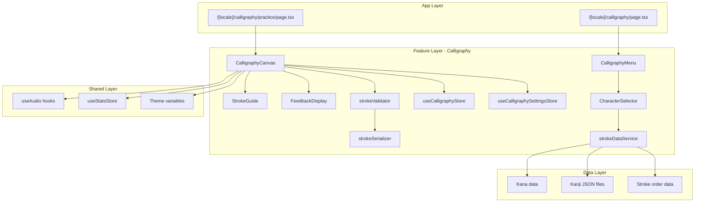

# Calligraphy Feature Design Document

## Overview

The Calligraphy feature extends KanaDojo with an interactive drawing-based practice mode for Japanese character writing. Users can practice Hiragana, Katakana, and Kanji on a digital canvas with stroke order guidance, real-time feedback, and progress tracking.

The feature integrates with existing KanaDojo patterns:

- Uses the feature-based architecture (`features/Calligraphy/`)
- Leverages existing Kana and Kanji data structures
- Follows established UI patterns with Tailwind CSS and theme variables
- Uses Zustand for state management with localStorage persistence
- Integrates with the existing audio feedback system

## Architecture



## Components and Interfaces

### Core Components

#### CalligraphyCanvas

The main drawing component using HTML5 Canvas API.

```typescript
interface CalligraphyCanvasProps {
  character: CharacterData;
  mode: 'practice' | 'free';
  onStrokeComplete: (stroke: StrokeData) => void;
  onCharacterComplete: (result: PracticeResult) => void;
}
```

Responsibilities:

- Handle touch and mouse input events
- Render user strokes in real-time
- Display reference character and ghost strokes
- Manage canvas sizing and aspect ratio

#### StrokeGuide

Displays stroke order guidance overlaid on the canvas.

```typescript
interface StrokeGuideProps {
  strokeOrder: StrokeOrderData;
  currentStrokeIndex: number;
  showNumbers: boolean;
  showDirections: boolean;
  showGhostStroke: boolean;
}
```

#### FeedbackDisplay

Shows scoring and feedback after character completion.

```typescript
interface FeedbackDisplayProps {
  score: number;
  strokeCountMatch: boolean;
  userStrokeCount: number;
  expectedStrokeCount: number;
  isPersonalBest: boolean;
}
```

#### CharacterSelector

Grid-based character selection organized by type and group.

```typescript
interface CharacterSelectorProps {
  characterType: 'hiragana' | 'katakana' | 'kanji';
  jlptLevel?: 'n5' | 'n4' | 'n3' | 'n2' | 'n1';
  onSelect: (character: CharacterData) => void;
}
```

### Services

#### strokeValidator

Compares user strokes against reference data.

```typescript
interface StrokeValidator {
  calculateSimilarity(
    userStrokes: StrokeData[],
    referenceStrokes: StrokeOrderData,
  ): SimilarityResult;

  compareStrokeCounts(
    userCount: number,
    referenceCount: number,
  ): StrokeCountComparison;
}

interface SimilarityResult {
  score: number; // 0-100
  strokeScores: number[];
  improvementAreas: ImprovementArea[];
}
```

#### strokeSerializer

Handles serialization/deserialization of stroke data.

```typescript
interface StrokeSerializer {
  serialize(strokes: StrokeData[]): string;
  deserialize(json: string): StrokeData[];
}
```

#### strokeDataService

Loads and caches stroke order data for characters.

```typescript
interface StrokeDataService {
  getStrokeOrder(
    character: string,
    type: CharacterType,
  ): Promise<StrokeOrderData>;
  preloadKanaStrokes(): Promise<void>;
  preloadKanjiStrokes(level: JLPTLevel): Promise<void>;
}
```

## Data Models

### StrokeData

Represents a single user-drawn stroke.

```typescript
interface StrokeData {
  id: string;
  points: Point[];
  startTime: number;
  endTime: number;
  pressure?: number[]; // Optional pressure data for supported devices
}

interface Point {
  x: number;
  y: number;
  timestamp: number;
}
```

### StrokeOrderData

Reference stroke order for a character.

```typescript
interface StrokeOrderData {
  character: string;
  type: 'hiragana' | 'katakana' | 'kanji';
  strokeCount: number;
  strokes: ReferenceStroke[];
}

interface ReferenceStroke {
  index: number;
  path: Point[];
  direction:
    | 'left-right'
    | 'right-left'
    | 'top-bottom'
    | 'bottom-top'
    | 'diagonal';
  startPoint: Point;
  endPoint: Point;
}
```

### CharacterData

Extended character information for calligraphy practice.

```typescript
interface CharacterData {
  character: string;
  romanji: string;
  type: 'hiragana' | 'katakana' | 'kanji';
  groupName?: string;
  // Kanji-specific fields
  onyomi?: string[];
  kunyomi?: string[];
  meanings?: string[];
  jlptLevel?: 'n5' | 'n4' | 'n3' | 'n2' | 'n1';
}
```

### PracticeResult

Result of a character practice session.

```typescript
interface PracticeResult {
  character: string;
  score: number;
  strokeCount: number;
  expectedStrokeCount: number;
  timestamp: number;
  mode: 'practice' | 'free';
  strokes: StrokeData[];
}
```

### CalligraphyProgress

Persisted progress data.

```typescript
interface CalligraphyProgress {
  characterHistory: Record<string, PracticeResult[]>;
  totalPracticed: number;
  averageScore: number;
  personalBests: Record<string, number>;
  lastPracticed: number;
}
```

### CalligraphySettings

User preferences for calligraphy practice.

```typescript
interface CalligraphySettings {
  strokeWidth: 'thin' | 'medium' | 'thick';
  smoothingEnabled: boolean;
  showStrokeNumbers: boolean;
  showDirectionHints: boolean;
  defaultMode: 'practice' | 'free';
}
```

## Correctness Properties

_A property is a characteristic or behavior that should hold true across all valid executions of a system-essentially, a formal statement about what the system should do. Properties serve as the bridge between human-readable specifications and machine-verifiable correctness guarantees._

### Property 1: Character selection displays correct characters

_For any_ character set type (Hiragana, Katakana, or Kanji with JLPT level), the character selector SHALL display all and only the characters belonging to that set, organized by their respective groups.
**Validates: Requirements 1.1, 4.1**

### Property 2: Stroke data capture preserves coordinates

_For any_ sequence of input coordinates drawn on the canvas, the captured StrokeData SHALL contain all coordinates in the same order with no data loss.
**Validates: Requirements 1.3**

### Property 3: Stroke completion creates discrete strokes

_For any_ drawing session, each pen-up event SHALL result in exactly one new StrokeData entry being added to the stroke collection.
**Validates: Requirements 1.4**

### Property 4: Clear action removes all strokes

_For any_ canvas state containing one or more strokes, invoking the clear action SHALL result in an empty stroke collection.
**Validates: Requirements 1.5**

### Property 5: Ghost stroke advances correctly

_For any_ practice session with N reference strokes, completing stroke K (where K < N) SHALL advance the ghost stroke indicator to stroke K+1.
**Validates: Requirements 2.2, 2.3**

### Property 6: Similarity score bounds

_For any_ comparison between user strokes and reference strokes, the calculated Similarity_Score SHALL be a number between 0 and 100 inclusive.
**Validates: Requirements 3.1, 3.2**

### Property 7: Score-based feedback consistency

_For any_ Similarity_Score, the system SHALL display improvement feedback when score < 50, and positive reinforcement when score >= 80.
**Validates: Requirements 3.3, 3.5**

### Property 8: Stroke count discrepancy detection

_For any_ user stroke count U and reference stroke count R where U ≠ R, the system SHALL indicate the discrepancy with the correct difference value.
**Validates: Requirements 3.4, 4.4**

### Property 9: Kanji metadata display

_For any_ selected Kanji character, the display SHALL include the character's onyomi readings, kunyomi readings, and meanings from the source data.
**Validates: Requirements 4.3**

### Property 10: Practice result persistence

_For any_ completed practice session, the PracticeResult (including score and timestamp) SHALL be retrievable from storage after the session ends.
**Validates: Requirements 5.1**

### Property 11: Statistics calculation accuracy

_For any_ set of practice results, the calculated statistics (total practiced, average score) SHALL match the mathematical aggregation of the underlying data.
**Validates: Requirements 5.2**

### Property 12: Personal best detection

_For any_ new practice result with score S for character C, if S is greater than all previous scores for C, the system SHALL identify it as a personal best.
**Validates: Requirements 5.4**

### Property 13: Mode switch preserves character

_For any_ mode switch between Practice_Mode and Free_Draw_Mode, the currently selected character SHALL remain unchanged.
**Validates: Requirements 6.4**

### Property 14: Input event processing

_For any_ valid input event (touch or mouse), the canvas SHALL capture the coordinates and add them to the current stroke.
**Validates: Requirements 7.1, 7.2**

### Property 15: Canvas aspect ratio preservation

_For any_ viewport resize, the canvas dimensions SHALL maintain a 1:1 aspect ratio.
**Validates: Requirements 7.3**

### Property 16: Touch scroll prevention

_For any_ touch event on the canvas during drawing, the default scroll behavior SHALL be prevented.
**Validates: Requirements 7.4**

### Property 17: Stroke width application

_For any_ stroke width setting change, all subsequently drawn strokes SHALL render with the new width value.
**Validates: Requirements 8.2**

### Property 18: Stroke smoothing reduces angles

_For any_ raw stroke input with sharp angles, applying smoothing SHALL produce a stroke with reduced angular variation.
**Validates: Requirements 8.4**

### Property 19: Stroke data round-trip serialization

_For any_ valid StrokeData array, serializing to JSON and deserializing back SHALL produce an equivalent StrokeData array.
**Validates: Requirements 9.1, 9.2, 9.3**

## Error Handling

### Canvas Errors

- **Touch/Mouse Event Failures**: Gracefully handle missing event properties; fall back to last known position
- **Canvas Context Unavailable**: Display fallback message if canvas 2D context cannot be obtained
- **Resize Failures**: Maintain minimum canvas size (200x200) if resize calculations fail

### Data Loading Errors

- **Stroke Order Data Missing**: Display character without stroke guidance; allow free drawing
- **Kanji Data Fetch Failure**: Show error toast; retry with exponential backoff
- **Invalid JSON Data**: Log error; skip malformed entries; continue with valid data

### Storage Errors

- **localStorage Full**: Warn user; offer to clear old practice data
- **Storage Unavailable**: Continue without persistence; warn user progress won't be saved
- **Corrupted Data**: Reset to defaults; log error for debugging

### Validation Errors

- **Invalid Stroke Data**: Skip invalid strokes in similarity calculation; note in feedback
- **Score Calculation Failure**: Default to 0 score; display error message

## Testing Strategy

### Property-Based Testing Library

The feature will use **fast-check** (already installed in the project) for property-based testing.

### Unit Tests

Unit tests will cover:

- Component rendering with various props
- Event handler behavior
- Utility function edge cases
- Store action correctness

### Property-Based Tests

Each correctness property will be implemented as a property-based test using fast-check. Tests will:

- Generate random but valid inputs using custom arbitraries
- Run a minimum of 100 iterations per property
- Tag each test with the format: `**Feature: calligraphy, Property {number}: {property_text}**`

Example test structure:

```typescript
describe('Calligraphy Properties', () => {
  it('Property 6: Similarity score bounds', () => {
    // **Feature: calligraphy, Property 6: Similarity score bounds**
    fc.assert(
      fc.property(
        arbitraryUserStrokes(),
        arbitraryReferenceStrokes(),
        (userStrokes, refStrokes) => {
          const result = calculateSimilarity(userStrokes, refStrokes);
          return result.score >= 0 && result.score <= 100;
        },
      ),
      { numRuns: 100 },
    );
  });
});
```

### Test Arbitraries

Custom arbitraries will be created for:

- `arbitraryPoint()` - Valid canvas coordinates
- `arbitraryStrokeData()` - Complete stroke with points
- `arbitraryReferenceStroke()` - Reference stroke with path and direction
- `arbitraryCharacterData()` - Valid character with metadata
- `arbitraryPracticeResult()` - Complete practice session result

### Integration Tests

Integration tests will verify:

- Canvas component with store integration
- Character selection to practice flow
- Progress persistence and retrieval
- Mode switching behavior
