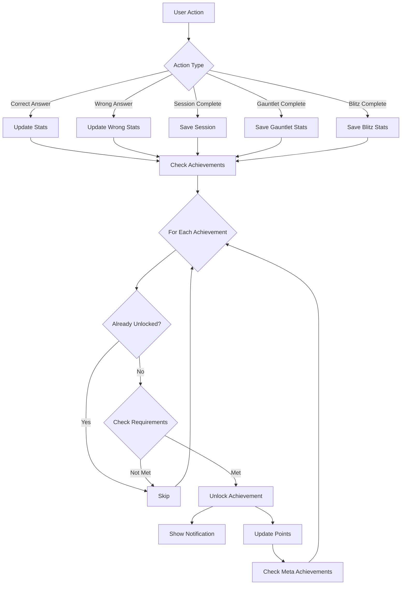

# Design Document: Expanded Achievements

## Overview

This design extends the existing KanaDojo achievement system with 70+ new achievements across all game modes and content types. The implementation preserves all existing achievements while adding new categories, requirement types, and tracking mechanisms.

## Architecture

### Extended Achievement Categories

The existing categories (`streak`, `milestone`, `consistency`, `mastery`, `exploration`) will be extended with new subcategories:

```
categories:
├── streak (existing)
├── milestone (existing)
├── consistency (existing)
├── mastery (existing)
├── exploration (existing)
├── kana (new)
├── kanji (new)
├── vocabulary (new)
├── gauntlet (new)
├── blitz (new)
├── speed (new)
└── fun (new)
```

### Extended Requirement Types

New requirement types to support the expanded achievements:

```typescript
type AchievementRequirementType =
  // Existing
  | 'streak'
  | 'total_correct'
  | 'sessions'
  | 'accuracy'
  | 'character_mastery'
  | 'dojo_completion'
  // New types
  | 'content_correct' // Correct answers for specific content type
  | 'content_mastery' // Mastery of specific content set
  | 'gauntlet_completion' // Gauntlet run completions
  | 'gauntlet_difficulty' // Gauntlet difficulty-specific
  | 'gauntlet_perfect' // Perfect Gauntlet runs
  | 'gauntlet_lives' // Life-related achievements
  | 'blitz_session' // Blitz session completions
  | 'blitz_score' // Blitz session scores
  | 'speed' // Time-based achievements
  | 'variety' // Exploration/variety achievements
  | 'days_trained' // Unique training days
  | 'time_of_day' // Time-based (night owl, early bird)
  | 'wrong_streak' // Consecutive wrong answers
  | 'exact_count' // Exact number achievements
  | 'achievement_count' // Meta achievements
  | 'total_points'; // Point-based achievements
```

## Components and Interfaces

### Extended Achievement Interface

```typescript
export interface Achievement {
  id: string;
  title: string;
  description: string;
  icon: string;
  rarity: AchievementRarity;
  points: number;
  unlockedAt?: Date;
  category: AchievementCategory;
  requirements: AchievementRequirement;
  rewards?: AchievementRewards;
  hidden?: boolean; // For secret achievements
}

export interface AchievementRequirement {
  type: AchievementRequirementType;
  value: number;
  additional?: {
    contentType?: 'hiragana' | 'katakana' | 'kanji' | 'vocabulary';
    jlptLevel?: 'N5' | 'N4' | 'N3' | 'N2' | 'N1';
    gameMode?: 'classic' | 'gauntlet' | 'blitz';
    difficulty?: 'normal' | 'hard' | 'instant-death';
    minAnswers?: number;
    timeWindowMs?: number;
    hourStart?: number;
    hourEnd?: number;
    dojos?: string[];
    modes?: string[];
  };
}
```

### Extended Stats Interface

The stats store needs additional tracking fields:

```typescript
interface ExtendedStats {
  // Content-specific tracking
  hiraganaCorrect: number;
  katakanaCorrect: number;
  kanjiCorrect: Record<string, number>; // By JLPT level
  vocabularyCorrect: number;

  // Mode-specific tracking
  gauntletStats: {
    totalRuns: number;
    completedRuns: number;
    normalCompleted: number;
    hardCompleted: number;
    instantDeathCompleted: number;
    perfectRuns: number;
    noDeathRuns: number;
    livesRegenerated: number;
    bestStreak: number;
  };

  blitzStats: {
    totalSessions: number;
    bestSessionScore: number;
    bestStreak: number;
    totalCorrect: number;
  };

  // Time tracking
  fastestAnswerMs: number;
  answerTimesMs: number[];

  // Variety tracking
  dojosUsed: Set<string>;
  modesUsed: Set<string>;
  challengeModesUsed: Set<string>;

  // Day tracking
  trainingDays: Set<string>; // ISO date strings

  // Wrong streak
  currentWrongStreak: number;
  maxWrongStreak: number;
}
```

## Data Models

### New Achievement Definitions

#### Kana Achievements (8 achievements)

```typescript
const KANA_ACHIEVEMENTS: Achievement[] = [
  {
    id: 'hiragana_apprentice',
    title: 'Hiragana Apprentice',
    icon: 'あ',
    rarity: 'common',
    points: 50,
    category: 'kana',
    requirements: {
      type: 'content_correct',
      value: 50,
      additional: { contentType: 'hiragana' },
    },
  },
  {
    id: 'hiragana_adept',
    title: 'Hiragana Adept',
    icon: 'い',
    rarity: 'uncommon',
    points: 150,
    category: 'kana',
    requirements: {
      type: 'content_correct',
      value: 200,
      additional: { contentType: 'hiragana' },
    },
  },
  {
    id: 'hiragana_master',
    title: 'Hiragana Master',
    icon: 'う',
    rarity: 'rare',
    points: 300,
    category: 'kana',
    requirements: {
      type: 'content_correct',
      value: 500,
      additional: { contentType: 'hiragana' },
    },
  },
  {
    id: 'katakana_apprentice',
    title: 'Katakana Apprentice',
    icon: 'ア',
    rarity: 'common',
    points: 50,
    category: 'kana',
    requirements: {
      type: 'content_correct',
      value: 50,
      additional: { contentType: 'katakana' },
    },
  },
  {
    id: 'katakana_adept',
    title: 'Katakana Adept',
    icon: 'イ',
    rarity: 'uncommon',
    points: 150,
    category: 'kana',
    requirements: {
      type: 'content_correct',
      value: 200,
      additional: { contentType: 'katakana' },
    },
  },
  {
    id: 'katakana_master',
    title: 'Katakana Master',
    icon: 'ウ',
    rarity: 'rare',
    points: 300,
    category: 'kana',
    requirements: {
      type: 'content_correct',
      value: 500,
      additional: { contentType: 'katakana' },
    },
  },
  {
    id: 'hiragana_perfectionist',
    title: 'Hiragana Perfectionist',
    icon: '💯',
    rarity: 'epic',
    points: 500,
    category: 'kana',
    requirements: {
      type: 'content_mastery',
      value: 100,
      additional: { contentType: 'hiragana' },
    },
  },
  {
    id: 'katakana_perfectionist',
    title: 'Katakana Perfectionist',
    icon: '💯',
    rarity: 'epic',
    points: 500,
    category: 'kana',
    requirements: {
      type: 'content_mastery',
      value: 100,
      additional: { contentType: 'katakana' },
    },
  },
];
```

#### Kanji Achievements (10 achievements)

```typescript
const KANJI_ACHIEVEMENTS: Achievement[] = [
  {
    id: 'n5_explorer',
    title: 'N5 Explorer',
    icon: '🔰',
    rarity: 'common',
    points: 75,
    category: 'kanji',
    requirements: {
      type: 'content_correct',
      value: 100,
      additional: { contentType: 'kanji', jlptLevel: 'N5' },
    },
  },
  {
    id: 'n4_explorer',
    title: 'N4 Explorer',
    icon: '📗',
    rarity: 'uncommon',
    points: 100,
    category: 'kanji',
    requirements: {
      type: 'content_correct',
      value: 100,
      additional: { contentType: 'kanji', jlptLevel: 'N4' },
    },
  },
  {
    id: 'n3_explorer',
    title: 'N3 Explorer',
    icon: '📘',
    rarity: 'rare',
    points: 150,
    category: 'kanji',
    requirements: {
      type: 'content_correct',
      value: 100,
      additional: { contentType: 'kanji', jlptLevel: 'N3' },
    },
  },
  {
    id: 'n2_explorer',
    title: 'N2 Explorer',
    icon: '📕',
    rarity: 'epic',
    points: 200,
    category: 'kanji',
    requirements: {
      type: 'content_correct',
      value: 100,
      additional: { contentType: 'kanji', jlptLevel: 'N2' },
    },
  },
  {
    id: 'n1_explorer',
    title: 'N1 Explorer',
    icon: '📙',
    rarity: 'legendary',
    points: 300,
    category: 'kanji',
    requirements: {
      type: 'content_correct',
      value: 100,
      additional: { contentType: 'kanji', jlptLevel: 'N1' },
    },
  },
  {
    id: 'n5_graduate',
    title: 'N5 Graduate',
    icon: '🎓',
    rarity: 'rare',
    points: 400,
    category: 'kanji',
    requirements: {
      type: 'content_mastery',
      value: 80,
      additional: { contentType: 'kanji', jlptLevel: 'N5' },
    },
  },
  {
    id: 'n4_graduate',
    title: 'N4 Graduate',
    icon: '🎓',
    rarity: 'epic',
    points: 500,
    category: 'kanji',
    requirements: {
      type: 'content_mastery',
      value: 80,
      additional: { contentType: 'kanji', jlptLevel: 'N4' },
    },
  },
  {
    id: 'n3_graduate',
    title: 'N3 Graduate',
    icon: '🎓',
    rarity: 'epic',
    points: 600,
    category: 'kanji',
    requirements: {
      type: 'content_mastery',
      value: 80,
      additional: { contentType: 'kanji', jlptLevel: 'N3' },
    },
  },
  {
    id: 'n2_graduate',
    title: 'N2 Graduate',
    icon: '🎓',
    rarity: 'legendary',
    points: 800,
    category: 'kanji',
    requirements: {
      type: 'content_mastery',
      value: 80,
      additional: { contentType: 'kanji', jlptLevel: 'N2' },
    },
  },
  {
    id: 'n1_graduate',
    title: 'N1 Graduate',
    icon: '👑',
    rarity: 'legendary',
    points: 1000,
    category: 'kanji',
    requirements: {
      type: 'content_mastery',
      value: 80,
      additional: { contentType: 'kanji', jlptLevel: 'N1' },
    },
  },
];
```

#### Vocabulary Achievements (6 achievements)

```typescript
const VOCABULARY_ACHIEVEMENTS: Achievement[] = [
  {
    id: 'word_collector',
    title: 'Word Collector',
    icon: '📝',
    rarity: 'common',
    points: 75,
    category: 'vocabulary',
    requirements: {
      type: 'content_correct',
      value: 100,
      additional: { contentType: 'vocabulary' },
    },
  },
  {
    id: 'lexicon_builder',
    title: 'Lexicon Builder',
    icon: '📖',
    rarity: 'uncommon',
    points: 200,
    category: 'vocabulary',
    requirements: {
      type: 'content_correct',
      value: 500,
      additional: { contentType: 'vocabulary' },
    },
  },
  {
    id: 'dictionary_devotee',
    title: 'Dictionary Devotee',
    icon: '📚',
    rarity: 'rare',
    points: 400,
    category: 'vocabulary',
    requirements: {
      type: 'content_correct',
      value: 1000,
      additional: { contentType: 'vocabulary' },
    },
  },
  {
    id: 'vocabulary_virtuoso',
    title: 'Vocabulary Virtuoso',
    icon: '🎭',
    rarity: 'epic',
    points: 750,
    category: 'vocabulary',
    requirements: {
      type: 'content_correct',
      value: 2500,
      additional: { contentType: 'vocabulary' },
    },
  },
  {
    id: 'word_wizard',
    title: 'Word Wizard',
    icon: '🧙',
    rarity: 'rare',
    points: 350,
    category: 'vocabulary',
    requirements: {
      type: 'content_mastery',
      value: 90,
      additional: { contentType: 'vocabulary', minAnswers: 50 },
    },
  },
  {
    id: 'linguistic_legend',
    title: 'Linguistic Legend',
    icon: '🏛️',
    rarity: 'legendary',
    points: 800,
    category: 'vocabulary',
    requirements: {
      type: 'content_mastery',
      value: 90,
      additional: { contentType: 'vocabulary', minAnswers: 200 },
    },
  },
];
```

#### Gauntlet Achievements (10 achievements)

```typescript
const GAUNTLET_ACHIEVEMENTS: Achievement[] = [
  {
    id: 'gauntlet_initiate',
    title: 'Gauntlet Initiate',
    icon: '⚔️',
    rarity: 'common',
    points: 50,
    category: 'gauntlet',
    requirements: { type: 'gauntlet_completion', value: 1 },
  },
  {
    id: 'gauntlet_survivor',
    title: 'Gauntlet Survivor',
    icon: '🛡️',
    rarity: 'uncommon',
    points: 100,
    category: 'gauntlet',
    requirements: {
      type: 'gauntlet_difficulty',
      value: 1,
      additional: { difficulty: 'normal' },
    },
  },
  {
    id: 'gauntlet_warrior',
    title: 'Gauntlet Warrior',
    icon: '⚔️',
    rarity: 'rare',
    points: 250,
    category: 'gauntlet',
    requirements: {
      type: 'gauntlet_difficulty',
      value: 1,
      additional: { difficulty: 'hard' },
    },
  },
  {
    id: 'gauntlet_legend',
    title: 'Gauntlet Legend',
    icon: '💀',
    rarity: 'legendary',
    points: 500,
    category: 'gauntlet',
    requirements: {
      type: 'gauntlet_difficulty',
      value: 1,
      additional: { difficulty: 'instant-death' },
    },
  },
  {
    id: 'gauntlet_veteran',
    title: 'Gauntlet Veteran',
    icon: '🎖️',
    rarity: 'uncommon',
    points: 150,
    category: 'gauntlet',
    requirements: { type: 'gauntlet_completion', value: 10 },
  },
  {
    id: 'gauntlet_champion',
    title: 'Gauntlet Champion',
    icon: '🏆',
    rarity: 'epic',
    points: 400,
    category: 'gauntlet',
    requirements: { type: 'gauntlet_completion', value: 50 },
  },
  {
    id: 'flawless_victory',
    title: 'Flawless Victory',
    icon: '✨',
    rarity: 'epic',
    points: 500,
    category: 'gauntlet',
    requirements: { type: 'gauntlet_perfect', value: 1 },
  },
  {
    id: 'untouchable',
    title: 'Untouchable',
    icon: '🌟',
    rarity: 'rare',
    points: 300,
    category: 'gauntlet',
    requirements: {
      type: 'gauntlet_lives',
      value: 0,
      additional: { type: 'no_lives_lost' },
    },
  },
  {
    id: 'phoenix_rising',
    title: 'Phoenix Rising',
    icon: '🔥',
    rarity: 'rare',
    points: 200,
    category: 'gauntlet',
    requirements: {
      type: 'gauntlet_lives',
      value: 5,
      additional: { type: 'lives_regenerated' },
    },
  },
  {
    id: 'gauntlet_streak_master',
    title: 'Gauntlet Streak Master',
    icon: '⚡',
    rarity: 'epic',
    points: 350,
    category: 'gauntlet',
    requirements: {
      type: 'streak',
      value: 50,
      additional: { gameMode: 'gauntlet' },
    },
  },
];
```

#### Blitz Achievements (8 achievements)

```typescript
const BLITZ_ACHIEVEMENTS: Achievement[] = [
  {
    id: 'speed_demon_initiate',
    title: 'Speed Demon Initiate',
    icon: '💨',
    rarity: 'common',
    points: 50,
    category: 'blitz',
    requirements: { type: 'blitz_session', value: 1 },
  },
  {
    id: 'blitz_warrior',
    title: 'Blitz Warrior',
    icon: '⚡',
    rarity: 'uncommon',
    points: 150,
    category: 'blitz',
    requirements: { type: 'blitz_score', value: 50 },
  },
  {
    id: 'blitz_champion',
    title: 'Blitz Champion',
    icon: '🏅',
    rarity: 'rare',
    points: 300,
    category: 'blitz',
    requirements: { type: 'blitz_score', value: 100 },
  },
  {
    id: 'lightning_reflexes',
    title: 'Lightning Reflexes',
    icon: '⚡',
    rarity: 'rare',
    points: 200,
    category: 'blitz',
    requirements: {
      type: 'streak',
      value: 25,
      additional: { gameMode: 'blitz' },
    },
  },
  {
    id: 'blitz_legend',
    title: 'Blitz Legend',
    icon: '🌩️',
    rarity: 'epic',
    points: 400,
    category: 'blitz',
    requirements: {
      type: 'streak',
      value: 50,
      additional: { gameMode: 'blitz' },
    },
  },
  {
    id: 'precision_under_pressure',
    title: 'Precision Under Pressure',
    icon: '🎯',
    rarity: 'epic',
    points: 350,
    category: 'blitz',
    requirements: {
      type: 'accuracy',
      value: 90,
      additional: { gameMode: 'blitz', minAnswers: 100 },
    },
  },
  {
    id: 'speed_addict',
    title: 'Speed Addict',
    icon: '🏃',
    rarity: 'uncommon',
    points: 100,
    category: 'blitz',
    requirements: { type: 'blitz_session', value: 10 },
  },
  {
    id: 'blitz_master',
    title: 'Blitz Master',
    icon: '👑',
    rarity: 'epic',
    points: 400,
    category: 'blitz',
    requirements: { type: 'blitz_session', value: 50 },
  },
];
```

#### Speed Achievements (5 achievements)

```typescript
const SPEED_ACHIEVEMENTS: Achievement[] = [
  {
    id: 'quick_draw',
    title: 'Quick Draw',
    icon: '🤠',
    rarity: 'uncommon',
    points: 100,
    category: 'speed',
    requirements: {
      type: 'speed',
      value: 30000,
      additional: { minAnswers: 10 },
    },
  },
  {
    id: 'speed_reader',
    title: 'Speed Reader',
    icon: '📖',
    rarity: 'rare',
    points: 200,
    category: 'speed',
    requirements: {
      type: 'speed',
      value: 60000,
      additional: { minAnswers: 25 },
    },
  },
  {
    id: 'instant_recognition',
    title: 'Instant Recognition',
    icon: '👁️',
    rarity: 'rare',
    points: 150,
    category: 'speed',
    requirements: {
      type: 'speed',
      value: 1000,
      additional: { type: 'single_answer' },
    },
  },
  {
    id: 'rapid_fire',
    title: 'Rapid Fire',
    icon: '🔫',
    rarity: 'epic',
    points: 300,
    category: 'speed',
    requirements: {
      type: 'speed',
      value: 2000,
      additional: { type: 'average', minAnswers: 50 },
    },
  },
  {
    id: 'efficient_learner',
    title: 'Efficient Learner',
    icon: '⏱️',
    rarity: 'rare',
    points: 250,
    category: 'speed',
    requirements: {
      type: 'speed',
      value: 300000,
      additional: { type: 'session', minAccuracy: 90 },
    },
  },
];
```

#### Extended Streak Achievements (5 achievements)

```typescript
const EXTENDED_STREAK_ACHIEVEMENTS: Achievement[] = [
  {
    id: 'streak_warrior',
    title: 'Streak Warrior',
    icon: '⚔️',
    rarity: 'epic',
    points: 400,
    category: 'streak',
    requirements: { type: 'streak', value: 75 },
  },
  {
    id: 'century_streak',
    title: 'Century Streak',
    icon: '💯',
    rarity: 'epic',
    points: 600,
    category: 'streak',
    requirements: { type: 'streak', value: 100 },
  },
  {
    id: 'streak_titan',
    title: 'Streak Titan',
    icon: '🗿',
    rarity: 'legendary',
    points: 800,
    category: 'streak',
    requirements: { type: 'streak', value: 150 },
  },
  {
    id: 'streak_immortal',
    title: 'Streak Immortal',
    icon: '♾️',
    rarity: 'legendary',
    points: 1000,
    category: 'streak',
    requirements: { type: 'streak', value: 200 },
  },
  {
    id: 'streak_god',
    title: 'Streak God',
    icon: '🌌',
    rarity: 'legendary',
    points: 2000,
    category: 'streak',
    requirements: { type: 'streak', value: 500 },
  },
];
```

#### Exploration Achievements (7 achievements)

```typescript
const EXPLORATION_ACHIEVEMENTS: Achievement[] = [
  {
    id: 'well_rounded',
    title: 'Well-Rounded',
    icon: '🌐',
    rarity: 'uncommon',
    points: 100,
    category: 'exploration',
    requirements: {
      type: 'variety',
      value: 3,
      additional: { dojos: ['kana', 'kanji', 'vocabulary'] },
    },
  },
  {
    id: 'mode_explorer',
    title: 'Mode Explorer',
    icon: '🧭',
    rarity: 'uncommon',
    points: 100,
    category: 'exploration',
    requirements: {
      type: 'variety',
      value: 4,
      additional: { modes: ['pick', 'reverse-pick', 'input', 'reverse-input'] },
    },
  },
  {
    id: 'triple_threat',
    title: 'Triple Threat',
    icon: '🎯',
    rarity: 'rare',
    points: 200,
    category: 'exploration',
    requirements: {
      type: 'variety',
      value: 3,
      additional: { challengeModes: ['classic', 'gauntlet', 'blitz'] },
    },
  },
  {
    id: 'consistent_learner',
    title: 'Consistent Learner',
    icon: '📅',
    rarity: 'common',
    points: 75,
    category: 'exploration',
    requirements: { type: 'days_trained', value: 5 },
  },
  {
    id: 'monthly_dedication',
    title: 'Monthly Dedication',
    icon: '🗓️',
    rarity: 'rare',
    points: 300,
    category: 'exploration',
    requirements: { type: 'days_trained', value: 30 },
  },
  {
    id: 'century_of_learning',
    title: 'Century of Learning',
    icon: '📆',
    rarity: 'epic',
    points: 600,
    category: 'exploration',
    requirements: { type: 'days_trained', value: 100 },
  },
  {
    id: 'year_of_mastery',
    title: 'Year of Mastery',
    icon: '🎊',
    rarity: 'legendary',
    points: 1500,
    category: 'exploration',
    requirements: { type: 'days_trained', value: 365 },
  },
];
```

#### Extended Milestone Achievements (6 achievements)

```typescript
const EXTENDED_MILESTONE_ACHIEVEMENTS: Achievement[] = [
  {
    id: 'dedicated_scholar',
    title: 'Dedicated Scholar',
    icon: '📚',
    rarity: 'rare',
    points: 350,
    category: 'milestone',
    requirements: { type: 'total_correct', value: 2500 },
  },
  {
    id: 'grand_master',
    title: 'Grand Master',
    icon: '🏛️',
    rarity: 'legendary',
    points: 1500,
    category: 'milestone',
    requirements: { type: 'total_correct', value: 10000 },
  },
  {
    id: 'legendary_scholar',
    title: 'Legendary Scholar',
    icon: '⭐',
    rarity: 'legendary',
    points: 3000,
    category: 'milestone',
    requirements: { type: 'total_correct', value: 25000 },
  },
  {
    id: 'session_veteran',
    title: 'Session Veteran',
    icon: '🎖️',
    rarity: 'rare',
    points: 400,
    category: 'consistency',
    requirements: { type: 'sessions', value: 250 },
  },
  {
    id: 'session_legend',
    title: 'Session Legend',
    icon: '🏆',
    rarity: 'epic',
    points: 700,
    category: 'consistency',
    requirements: { type: 'sessions', value: 500 },
  },
  {
    id: 'eternal_student',
    title: 'Eternal Student',
    icon: '♾️',
    rarity: 'legendary',
    points: 1200,
    category: 'consistency',
    requirements: { type: 'sessions', value: 1000 },
  },
];
```

#### Point-Based Achievements (3 achievements)

```typescript
const POINT_ACHIEVEMENTS: Achievement[] = [
  {
    id: 'point_collector',
    title: 'Point Collector',
    icon: '💰',
    rarity: 'uncommon',
    points: 100,
    category: 'milestone',
    requirements: { type: 'total_points', value: 1000 },
  },
  {
    id: 'point_hoarder',
    title: 'Point Hoarder',
    icon: '💎',
    rarity: 'rare',
    points: 250,
    category: 'milestone',
    requirements: { type: 'total_points', value: 5000 },
  },
  {
    id: 'point_master',
    title: 'Point Master',
    icon: '👑',
    rarity: 'epic',
    points: 500,
    category: 'milestone',
    requirements: { type: 'total_points', value: 10000 },
  },
];
```

#### Fun/Secret Achievements (10 achievements)

```typescript
const FUN_ACHIEVEMENTS: Achievement[] = [
  {
    id: 'learning_from_mistakes',
    title: 'Learning from Mistakes',
    icon: '🤔',
    rarity: 'common',
    points: 10,
    category: 'fun',
    requirements: { type: 'total_incorrect', value: 1 },
    hidden: false,
  },
  {
    id: 'perseverance',
    title: 'Perseverance',
    icon: '💪',
    rarity: 'uncommon',
    points: 50,
    category: 'fun',
    requirements: { type: 'wrong_streak', value: 5 },
  },
  {
    id: 'night_owl',
    title: 'Night Owl',
    icon: '🦉',
    rarity: 'uncommon',
    points: 75,
    category: 'fun',
    requirements: {
      type: 'time_of_day',
      value: 1,
      additional: { hourStart: 0, hourEnd: 1 },
    },
    hidden: true,
  },
  {
    id: 'early_bird',
    title: 'Early Bird',
    icon: '🐦',
    rarity: 'uncommon',
    points: 75,
    category: 'fun',
    requirements: {
      type: 'time_of_day',
      value: 1,
      additional: { hourStart: 5, hourEnd: 6 },
    },
    hidden: true,
  },
  {
    id: 'answer_to_everything',
    title: 'Answer to Everything',
    icon: '🌌',
    rarity: 'rare',
    points: 142,
    category: 'fun',
    requirements: { type: 'exact_count', value: 42 },
    hidden: true,
  },
  {
    id: 'perfect_century',
    title: 'Perfect Century',
    icon: '💯',
    rarity: 'rare',
    points: 200,
    category: 'fun',
    requirements: { type: 'exact_count', value: 100 },
    hidden: true,
  },
  {
    id: 'achievement_hunter',
    title: 'Achievement Hunter',
    icon: '🎯',
    rarity: 'uncommon',
    points: 100,
    category: 'fun',
    requirements: { type: 'achievement_count', value: 10 },
  },
  {
    id: 'achievement_collector',
    title: 'Achievement Collector',
    icon: '🏅',
    rarity: 'rare',
    points: 250,
    category: 'fun',
    requirements: { type: 'achievement_count', value: 25 },
  },
  {
    id: 'achievement_enthusiast',
    title: 'Achievement Enthusiast',
    icon: '🎖️',
    rarity: 'epic',
    points: 500,
    category: 'fun',
    requirements: { type: 'achievement_count', value: 50 },
  },
  {
    id: 'completionist',
    title: 'Completionist',
    icon: '🌟',
    rarity: 'legendary',
    points: 2000,
    category: 'fun',
    requirements: { type: 'achievement_count', value: -1 },
    hidden: true,
  }, // -1 means all
];
```

## Correctness Properties

_A property is a characteristic or behavior that should hold true across all valid executions of a system-essentially, a formal statement about what the system should do. Properties serve as the bridge between human-readable specifications and machine-verifiable correctness guarantees._

### Property 1: Threshold Achievement Unlocking

_For any_ achievement with a threshold-based requirement (total*correct, sessions, content_correct, etc.) and \_for any* stats state where the relevant counter equals or exceeds the threshold value, the achievement SHALL be unlocked if not already unlocked.

**Validates: Requirements 1.1-1.6, 2.1-2.5, 3.1-3.4, 4.5-4.6, 5.2-5.3, 5.7-5.8, 7.1-7.5, 8.4-8.7, 9.1-9.6, 9.7-9.9**

### Property 2: Mastery Achievement Unlocking

_For any_ achievement with a mastery-based requirement and _for any_ character mastery state where all characters in the target set have accuracy >= the required threshold, the achievement SHALL be unlocked if not already unlocked.

**Validates: Requirements 1.7-1.8, 2.6-2.10, 3.5-3.6**

### Property 3: Mode Completion Achievement Unlocking

_For any_ Gauntlet or Blitz completion achievement and _for any_ session completion event matching the required criteria (difficulty, completion status), the achievement SHALL be unlocked if not already unlocked.

**Validates: Requirements 4.1-4.4, 4.7-4.8, 5.1**

### Property 4: Streak Achievement Unlocking

_For any_ streak-based achievement and _for any_ streak value >= the required threshold, the achievement SHALL be unlocked if not already unlocked.

**Validates: Requirements 4.10, 5.4-5.5, 7.1-7.5**

### Property 5: Time-Based Achievement Unlocking

_For any_ speed achievement and _for any_ timing data meeting the speed criteria (total time, average time, or single answer time), the achievement SHALL be unlocked if not already unlocked.

**Validates: Requirements 6.1-6.5**

### Property 6: Variety Achievement Unlocking

_For any_ variety/exploration achievement and _for any_ state where the user has used all required dojos/modes/challenge types, the achievement SHALL be unlocked if not already unlocked.

**Validates: Requirements 8.1-8.3**

### Property 7: Meta Achievement Unlocking

_For any_ meta achievement (achievement*count type) and \_for any* state where the number of unlocked achievements >= the required count, the achievement SHALL be unlocked if not already unlocked.

**Validates: Requirements 10.7-10.10**

## Error Handling

### Achievement Check Failures

- If stats data is malformed or missing, achievement checks should fail gracefully without crashing
- Missing optional fields should use sensible defaults (0 for counts, empty sets for collections)
- Invalid achievement IDs should be logged but not prevent other achievements from being checked

### Storage Errors

- If localStorage is unavailable, achievements should still function in-memory for the session
- Corrupted achievement data should trigger a recovery mechanism that preserves unlocked achievements where possible

### Edge Cases

- Achievements should not unlock multiple times (idempotent unlocking)
- Meta achievements (achievement_count) should not count themselves in the count
- The "Completionist" achievement should dynamically calculate total achievements excluding itself

## Testing Strategy

### Unit Tests

Unit tests will cover:

- Individual achievement requirement checking functions
- Edge cases for each requirement type
- Time-of-day calculations for Night Owl/Early Bird
- Exact count matching for fun achievements

### Property-Based Tests

Using fast-check for property-based testing:

1. **Threshold Property Test**: Generate random stats with counts, verify achievements unlock at correct thresholds
2. **Mastery Property Test**: Generate random character mastery data, verify mastery achievements unlock correctly
3. **Streak Property Test**: Generate random streak sequences, verify streak achievements unlock at correct values
4. **Idempotency Test**: Verify that checking achievements multiple times with same stats produces same result
5. **Meta Achievement Test**: Generate random achievement unlock sequences, verify meta achievements unlock at correct counts

### Integration Tests

- Test achievement checking integrates correctly with stats store updates
- Test Gauntlet completion triggers correct achievement checks
- Test Blitz session completion triggers correct achievement checks
- Test day tracking persists correctly across sessions

## Implementation Notes

### Backward Compatibility

- All existing achievements in `ACHIEVEMENTS` array must be preserved
- New achievements will be appended to the array
- Existing localStorage data structure must remain compatible
- Achievement IDs must not conflict with existing IDs

### Performance Considerations

- Achievement checks should be batched to avoid multiple re-renders
- Content-specific tracking should use efficient data structures (Maps over Objects where appropriate)
- Day tracking should use Set for O(1) lookup

### Stats Store Extensions

The stats store will need new fields added without breaking existing functionality:

- Use Zustand's `partialize` to only persist necessary fields
- Add migration logic for existing users to initialize new tracking fields

### Mermaid Diagram: Achievement Check Flow


